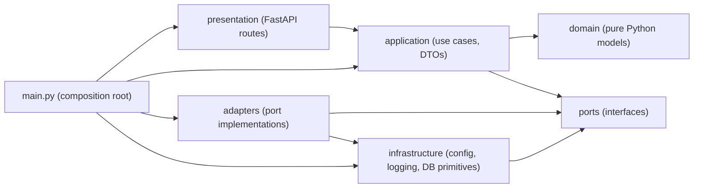
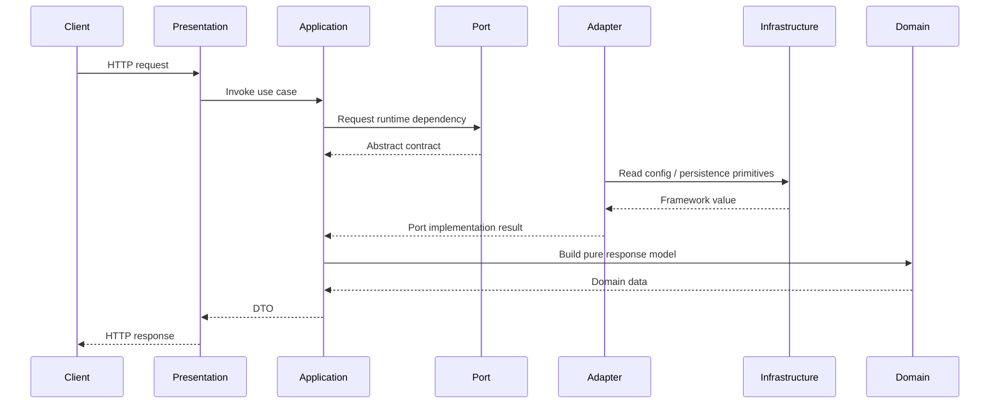

# ADR-0001: Adopt Domain-Driven Design and Hexagonal Architecture

Date: 2026-07-09
Status: Accepted

## Context

HYDRA started as a compact FastAPI-first scaffold. That structure was sufficient for bootstrapping, but it mixed framework concerns, configuration, and persistence too closely with the emerging business model. The SDS requires modularity, testability, observability, and documentation discipline. To support those requirements without adding trading, market collection, websocket, or exchange-specific behavior, the codebase is being restructured into a DDD-inspired Hexagonal Architecture.

## Decision

The codebase is reorganized into these top-level packages under `src/hydra`:

- `domain/`: pure Python business concepts and rules
- `application/`: use cases and DTOs
- `ports/`: interfaces consumed by the application
- `adapters/`: implementations of ports and persistence adapters
- `infrastructure/`: framework and runtime wiring
- `presentation/`: HTTP-facing API layer
- `shared/`: cross-cutting helpers with no framework ownership

## Dependency Rules

1. `domain` must remain pure Python.
2. `application` may depend only on `domain` and `ports`.
3. `presentation` may depend only on `application` plus its own framework.
4. `adapters` implement `ports`.
5. `infrastructure` may depend on `ports` and framework libraries.
6. `main.py` acts as the composition root and wires the layers together.

## Package Diagram

## Request Flow

## Consequences

### Positive

- Business concepts now live outside FastAPI and SQLAlchemy.
- The application layer is easier to test without framework bootstrapping.
- Port-driven dependencies make future adapters explicit.
- Composition responsibility is localized to `main.py`.

### Negative

- The project now has more packages and indirection than the initial scaffold.
- Persistence mapping is intentionally separated from domain entities, which introduces duplication.

### Neutral

- External HTTP behavior remains unchanged.
- No new trading, collector, websocket, or exchange logic is introduced by this ADR.

## Alternatives Considered

### Keep the existing layered scaffold

Rejected because configuration, persistence, and HTTP concerns were still too close to the emerging business model.

### Full Clean Architecture with repository implementations now

Rejected for this refactor because the goal is structural change without adding new business features.

## Follow-up Notes

- Future repository ports should be introduced when real use cases begin to consume persistence.
- Future module-specific use cases should live in `application/`.
- Future database adapters should continue to keep SQLAlchemy out of `domain/`.

