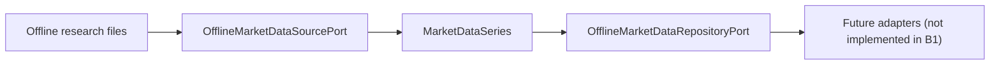

# ADR-0002: Add an Offline Market Data Domain Model

Date: 2026-07-17
Status: Accepted

## Context

Milestone B begins after HYDRA completed platform hardening, branch-governed delivery,
and DDD plus Hexagonal Architecture adoption. The next safe step is to introduce a
pure domain model for research-oriented market data without adding collectors,
exchange clients, infrastructure adapters, or HTTP behavior.

The repository already enforces:

- branch and PR based delivery for controlled feature work
- framework-free domain rules
- ports-before-adapters dependency direction
- offline-first safety expectations
- explicit non-goals around live trading and exchange execution

HYDRA needs a first-class market data vocabulary so future offline import,
validation, storage, and research workflows can share the same language.

## Decision

Add a new pure Python module at `src/hydra/domain/market_data.py` and a matching
port contract module at `src/hydra/ports/market_data.py`.

The new domain model includes:

- `Symbol`
- `Market`
- `Timeframe`
- `OHLCVBar`
- `MarketDataSeries`
- `DataQualityIssue`
- `DataSourceDescriptor`

The new port contracts include:

- `OfflineMarketDataRepositoryPort`
- `OfflineMarketDataSourcePort`

These additions are intentionally offline-first and exchange-agnostic.

## Affected Layers

- `domain/`: new market data value objects and entities
- `ports/`: new offline repository and source contracts
- `tests/`: domain validation coverage and architecture safety checks
- `docs/`: ADR, research-data guidance, and review package updates

No application orchestration, adapters, infrastructure implementations, or
presentation routes are introduced in this ADR.

## Diagram

## Alternatives Considered

### Reuse `MarketBar` and extend it in place

Rejected because the existing scaffold entity is too generic for the explicit
validation and source metadata needed by an offline-first market data model.

### Add SQLAlchemy models first

Rejected because Milestone B requires domain-first progress and keeps persistence
implementation out of scope.

### Add exchange-specific adapters now

Rejected because vendor coupling would violate the exchange-agnostic scope and
would pull networking concerns into an otherwise safe platform sprint.

## Consequences

### Positive

- future data workflows can speak a shared market data language
- validation moves into pure domain code before storage or APIs exist
- ports make future offline adapters explicit without committing to a vendor

### Negative

- the repository now contains both legacy scaffold entities and a newer domain
  model, which increases temporary conceptual overlap
- future adapters will still need mapping logic into this domain model

### Neutral

- no existing HTTP behavior changes
- no infrastructure wiring changes
- no runtime dependencies are added

## Rollback Strategy

If the model proves too narrow or too broad, revert the new domain module,
market data ports, tests, and related documentation as a single PR. Because no
runtime wiring or persistence implementation is added, rollback is low risk and
does not require data migration.

## Explicit Non-Goals

- no live trading
- no exchange execution
- no Binance integration
- no WebSocket
- no exchange API keys
- no live market data collection
- no real-money operations
