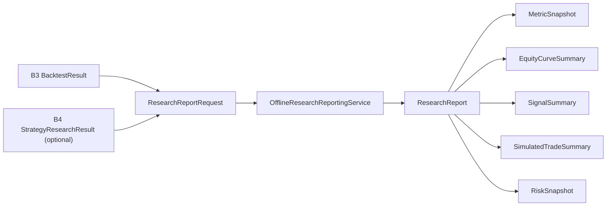

# ADR-0006: Add an Offline Research Reporting Foundation

Date: 2026-07-18
Status: Accepted

## Context

HYDRA already has:

- B1 offline market data modeling
- B3 deterministic in-memory backtesting results
- B4 offline strategy research result orchestration
- B5 a deterministic fixture-based research provider for local signal creation

The next safe step is to introduce a structured reporting boundary that can
summarize completed offline research outputs without adding files, exports,
dashboards, persistence, or runtime integrations.

Milestone B still requires:

- pure domain models for business summaries
- deterministic, in-memory behavior
- no wall-clock dependency in report generation
- no infrastructure, presentation, or adapter coupling
- no execution, broker, or exchange-facing behavior

HYDRA needs a first-class reporting language so completed backtests and
optional research results can be summarized consistently before any future
exporter, chart, dashboard, or storage work is considered.

## Decision

Add an offline, in-memory research reporting foundation composed of:

- `src/hydra/domain/research_reporting.py`
- `src/hydra/application/research_reporting_dto.py`
- `src/hydra/application/research_reporting_service.py`

The new boundary summarizes `BacktestResult` and optional
`StrategyResearchResult` inputs into structured report value objects.

The reporting foundation introduces:

- `ResearchReportId`
- `MetricSnapshot`
- `EquityCurveSummary`
- `SignalSummary`
- `SimulatedTradeSummary`
- `RiskSnapshot`
- `ResearchReport`
- `ResearchReportRequest`
- `ResearchReportGenerationError`
- `ResearchReportGenerationResult`
- `OfflineResearchReportingService`

This boundary remains:

- deterministic
- synchronous
- local
- offline-first
- in-memory only

No chart rendering, file writing, export formatting, or persistence behavior
is added in this ADR.

## Affected Layers

- `domain/`: new pure report value objects and validation rules
- `application/`: request/result DTOs and deterministic report construction
- `tests/`: domain coverage, service coverage, and architecture guardrails
- `docs/`: ADR, research note, and review package

No new `ports/`, `adapters/`, `infrastructure/`, or `presentation/`
implementation is introduced for B6.

## Diagram

## Alternatives Considered

### Add export formats first

Rejected because PDF, HTML, Markdown, and filesystem writers would add IO and
formatting concerns before the report model itself is stable.

### Put report construction inside the backtesting service

Rejected because B3 should remain focused on simulation, not post-processing
and research summarization.

### Add a dashboard-facing reporting adapter now

Rejected because B6 must stay in-memory and deterministic, with no
presentation or infrastructure dependency.

## Consequences

### Positive

- completed offline research now has a structured summary language
- B3 and B4 outputs can be combined without adding new runtime dependencies
- future exporters or dashboards can target a stable report object boundary

### Negative

- another application boundary adds additional orchestration structure
- reporting is intentionally summary-only and does not yet include rendering or
  persistence

### Neutral

- no runtime configuration changes are required
- no existing API behavior changes
- no network or scheduler behavior is introduced

## Rollback Strategy

If the reporting boundary proves too narrow or awkward, revert the new domain
module, application DTOs, service, tests, and documentation together in one
PR. Because B6 is in-memory only and does not change persistence or APIs,
rollback remains low risk and requires no migration.

## Explicit Non-Goals

- no live trading
- no paper trading
- no exchange integration
- no Binance integration
- no broker integration
- no API keys
- no WebSocket
- no external network calls
- no real order execution
- no wallet logic
- no database persistence
- no API endpoints
- no background workers
- no AI strategy generation
- no ML models
- no automatic trading
- no production strategy implementation
- no indicator engine
- no moving-average strategy
- no RSI strategy
- no optimizer
- no chart rendering
- no PDF export
- no HTML export
- no filesystem report writer
- no dashboard
