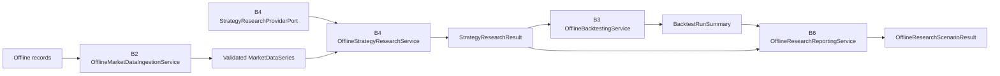

# ADR-0007: Add an End-to-End Offline Research Scenario Service

Date: 2026-07-19
Status: Accepted

## Context

HYDRA already has the building blocks for a deterministic offline research
path:

- B1 defines the offline market data domain language
- B2 ingests offline records into validated `MarketDataSeries`
- B3 simulates deterministic backtests in memory
- B4 defines an application-facing strategy research boundary through
  `StrategyResearchProviderPort`
- B5 supplies a deterministic fixture provider that proves the B4 port can be
  satisfied without runtime IO
- B6 summarizes completed backtest and research outputs into a deterministic
  report object

What HYDRA still lacks is one application-level seam that connects those
already-approved pieces without introducing a workflow runner, transport
layer, persistence boundary, or production execution path.

Milestone B still requires:

- offline-first behavior
- deterministic in-memory orchestration
- no adapter coupling inside the application seam
- no wall-clock dependency
- no file writing, export rendering, or external calls

## Decision

Add an application-level deterministic offline research scenario service that
orchestrates the approved in-memory boundaries from B2, B4, B3, and B6.

The new boundary is composed of:

- `src/hydra/application/offline_research_scenario_dto.py`
- `src/hydra/application/offline_research_scenario_service.py`

The scenario service:

- accepts offline records directly
- executes `OfflineMarketDataIngestionService`
- constructs `OfflineStrategyResearchService` from an injected
  `StrategyResearchProviderPort`
- hands the successful strategy result to `OfflineBacktestingService`
- hands the successful backtest result to `OfflineResearchReportingService`
- returns one deterministic result object that preserves partial stage outputs
  on failure

Application code does not import the B5 concrete fixture provider. Tests may
inject the B5 provider through the B4 port because the application boundary
depends on the port contract, not the adapter implementation.

## Affected Layers

- `application/`: new scenario DTOs and orchestration service
- `tests/`: end-to-end unit coverage and architecture guardrails
- `docs/`: ADR, research note, and review package

No new `domain/`, `ports/`, `adapters/`, `infrastructure/`, or
`presentation/` implementations are introduced for B7.

## Diagram

## Alternatives Considered

### Create a workflow runner now

Rejected because B7 must remain a small application seam, not a scheduler,
job orchestrator, or automation framework.

### Import the deterministic fixture provider directly into application code

Rejected because that would reverse dependency direction and couple the
application layer to one adapter implementation.

### Add a new domain aggregate for the full scenario

Rejected because the scenario is orchestration across existing boundaries, not
new business behavior that needs a new domain model.

## Consequences

### Positive

- HYDRA now has a single deterministic offline path that proves B2, B4, B3,
  and B6 work together
- partial stage outputs are preserved for debugging and review
- tests can inject deterministic providers without adapter imports in
  production code

### Negative

- the application layer now contains one additional orchestration seam
- the scenario remains intentionally narrow and cannot yet express richer
  multi-run research workflows

### Neutral

- no runtime configuration changes are required
- no persistence or API changes are introduced
- no infrastructure or presentation changes are required

## Rollback Strategy

If the scenario seam proves unnecessary or incorrectly scoped, revert the new
application DTOs, service, tests, and documentation together in one PR.
Because B7 is in-memory only and does not change persistence, APIs, or
runtime integrations, rollback remains low risk.

## Explicit Non-Goals

- no live trading
- no paper trading
- no exchange integration
- no Binance integration
- no broker integration
- no API keys
- no WebSocket
- no external network calls
- no real order execution
- no wallet logic
- no database persistence
- no API endpoints
- no background workers
- no scheduler
- no CLI
- no dashboard
- no AI strategy generation
- no ML models
- no automatic trading
- no production strategy implementation
- no indicator engine
- no moving-average strategy
- no RSI strategy
- no optimizer
- no chart rendering
- no PDF export
- no HTML export
- no filesystem report writer
