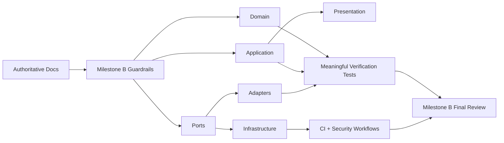

# ADR-0008: Milestone B Final Hardening and Review

- Status: Accepted
- Date: 2026-07-19
- Deciders: HYDRA engineering
- Supersedes: None
- Superseded by: None

## Context

Milestone B completed the offline-first research foundation through B1-B7:

- offline market-data domain modeling
- offline dataset ingestion
- offline backtesting skeleton
- deterministic strategy research
- research reporting
- end-to-end offline research orchestration

Before moving beyond Milestone B, HYDRA needed a final hardening pass that
improves confidence without changing external behavior or adding business
features. The authoritative documents in `docs/` already define the intended
scope:

- no live trading
- no exchange integration
- no WebSocket runtime
- no network-dependent research execution

The remaining engineering need was verification quality: coverage depth,
document consistency, and CI/Security maintenance.

## Decision

HYDRA will treat Milestone B finalization as a verification-focused hardening
phase with these decisions:

1. Raise coverage using meaningful tests around existing domain and DTO
   invariants instead of synthetic or implementation-coupled tests.
2. Keep production behavior unchanged unless a critical defect is exposed by
   tests.
3. Align repository-facing documentation with the actual offline-first
   Milestone B architecture.
4. Keep GitHub Actions versions current through low-risk maintenance updates
   when the changes are limited to upstream action version bumps.
5. Ship a final review package that records local quality gates, PR evidence,
   and CI/Security status before Milestone B is considered complete.

## Architecture View

## Consequences

### Positive

- Milestone B exits with stronger confidence in invariant-heavy code paths.
- Coverage is improved without distorting the architecture.
- Public repository messaging now matches the documented offline-first scope.
- CI/Security workflows remain current without weakening controls.

### Negative

- Some non-core platform modules remain less tested than the core offline
  research path.
- Verification depth increased test volume and review surface.

### Neutral

- No new runtime capability is introduced.
- No trading, exchange, or network behavior is added.

## Alternatives Considered

### Add new platform features during B8

Rejected. B8 is a hardening milestone, not a feature milestone.

### Increase coverage by testing private implementation details directly

Rejected. The hardening goal is confidence in externally observable behavior and
domain/application invariants, not brittle white-box coverage inflation.

### Leave workflow maintenance for a later sprint

Rejected. Repository health is part of release confidence and belongs in the
same milestone closure review.

## Follow-up

- Use the B8 review package as the milestone exit artifact.
- Keep future work aligned with the offline-first architectural boundaries.
- Raise coverage in lower-priority platform modules only when those modules
  become active delivery scope.
