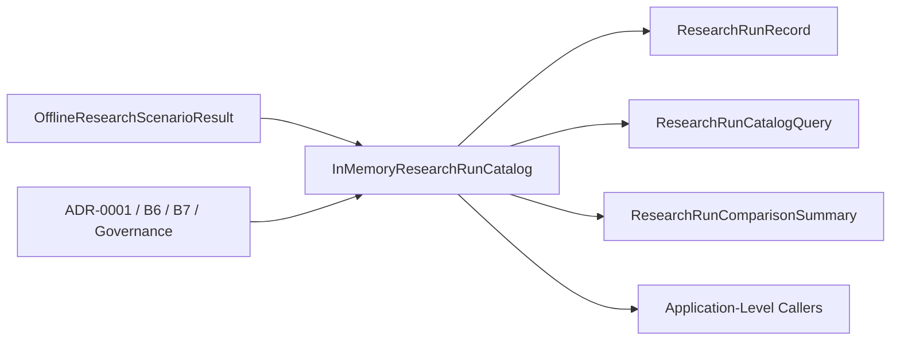

# ADR-0009: In-Memory Research Run Catalog

- Status: Accepted
- Date: 2026-07-20
- Deciders: HYDRA engineering
- Supersedes: None
- Superseded by: None

## Context

Milestone B closed with an offline-first research flow that can ingest fixture
datasets, execute deterministic strategy research, run offline backtesting,
generate research reports, and assemble end-to-end
`OfflineResearchScenarioResult` objects.

Milestone C begins with a usability need rather than a new runtime capability:
once offline scenario results already exist in memory, engineers need a simple,
deterministic way to catalog them during a single process lifetime. The system
must answer basic comparison questions without introducing persistence, runtime
infrastructure, or new delivery surfaces.

The catalog must remain aligned with ADR-0001 and the Milestone B decisions:

- keep the domain layer pure
- keep orchestration in the application layer
- avoid new adapters, infrastructure, and presentation concerns
- preserve offline-first boundaries
- avoid wall-clock, file, database, and network dependencies

## Decision

HYDRA will add an application-layer in-memory catalog for offline research
scenario results.

The catalog records already-produced `OfflineResearchScenarioResult` objects and
provides deterministic:

1. storage within a single catalog instance
2. retrieval by `scenario_id`
3. insertion-order listing
4. query-based filtering
5. comparison summaries across existing run metrics

The catalog will not execute research, persist data, export files, expose APIs,
or integrate with runtime infrastructure.

## Affected Layers

- `application`
  - owns the C1 DTOs and in-memory catalog service
- `domain`
  - remains unchanged and is only consumed through existing result objects
- `ports`
  - unchanged; no new contract is introduced in C1
- `adapters`
  - unchanged; no adapter implementation is needed
- `infrastructure`
  - unchanged; no persistence or runtime service is introduced
- `presentation`
  - unchanged; no route, CLI, or UI surface is introduced

## Architecture View

## Alternatives Considered

### Add a repository port and persistence abstraction now

Rejected. C1 is explicitly process-local and should not pull persistence design
forward before a proven need exists.

### Store results in files or JSON

Rejected. File-oriented state would add I/O, serialization decisions, and a
lifecycle concern outside the scope of the first usability seam.

### Add an API or dashboard first

Rejected. Milestone C starts with an internal application seam, not a new
delivery surface.

### Put the catalog in the domain layer

Rejected. The catalog is orchestration-oriented and operates on application DTO
results rather than pure domain concepts.

## Consequences

### Positive

- Engineers can inspect and compare offline research runs without rerunning
  scenarios.
- The result catalog remains deterministic and easy to test.
- No runtime infrastructure or persistence burden is introduced.
- The architecture stays consistent with DDD + Hexagonal boundaries.

### Negative

- Catalog state exists only for the lifetime of a catalog instance.
- Results are not shared across processes or restarts.
- Future persistence work, if needed, will require a deliberate later design.

### Neutral

- No business capability is expanded.
- No external behavior is added beyond the new application-layer seam.

## Explicit Non-Goals

- no live trading
- no paper trading
- no exchange integration
- no Binance integration
- no broker integration
- no API keys
- no WebSocket
- no external network calls
- no real order execution
- no wallet logic
- no database persistence
- no file persistence
- no JSON persistence
- no CSV persistence
- no API endpoints
- no background workers
- no scheduler
- no CLI
- no dashboard
- no AI strategy generation
- no ML models
- no automatic trading
- no production strategy implementation
- no indicator engine
- no moving-average strategy
- no RSI strategy
- no optimizer
- no chart rendering
- no PDF export
- no HTML export
- no filesystem report writer

## Rollback Strategy

If C1 proves misaligned, remove the application DTO/service pair and their
tests, then revert ADR-0009 and the related research/review documents. Because
the design is process-local and introduces no schema, adapter, or infrastructure
changes, rollback remains low risk.
