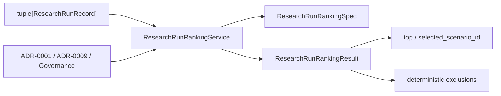

# ADR-0010: Research Run Ranking and Selection

- Status: Accepted
- Date: 2026-07-20
- Deciders: HYDRA engineering
- Supersedes: None
- Superseded by: None

## Context

Milestone C began by adding C1, an application-layer in-memory catalog for
already-produced offline research scenario results. C1 made the results visible
within a single process lifetime, but it intentionally stopped short of
expressing which runs should be preferred, filtered, or selected under stable
rules.

The next usability seam is deterministic ranking over existing
`ResearchRunRecord` objects. This seam must:

- build on C1 rather than replacing it
- remain storage-agnostic and independent from catalog implementation details
- use only existing metrics already exposed by C1 records
- preserve offline-first and process-local boundaries
- avoid wall-clock, persistence, network, and runtime infrastructure concerns

## Decision

HYDRA will add an application-layer deterministic ranking and selection service
for C1 `ResearchRunRecord` objects.

The service ranks already-cataloged records by existing metrics, applies
eligibility filters, exposes top selection, and preserves stable tie-breaking
by input order. It does not execute research, persist data, expose APIs, render
dashboards, export files, or integrate with runtime infrastructure.

## Affected Layers

- `application`
  - owns the C2 ranking DTOs and ranking service
- `domain`
  - remains unchanged and is only consumed through existing C1 record metrics
- `ports`
  - unchanged; no new contract is introduced in C2
- `adapters`
  - unchanged; no adapter behavior is needed
- `infrastructure`
  - unchanged; no persistence or runtime service is introduced
- `presentation`
  - unchanged; no route, CLI, or UI surface is introduced

## Architecture View

## Alternatives Considered

### Rank directly inside `InMemoryResearchRunCatalog`

Rejected. C2 should remain independent from catalog storage so it can consume
any iterable of `ResearchRunRecord` values.

### Move ranking into the domain layer

Rejected. The ranking seam operates on application-layer C1 records rather than
on pure domain entities.

### Add persistence-backed ranking now

Rejected. Milestone C is still process-local and offline-first; durable storage
belongs to a later, explicit design step if it becomes necessary.

### Add dashboard or export delivery before ranking rules

Rejected. Deterministic ranking logic should exist before any later delivery
surface depends on it.

## Consequences

### Positive

- Engineers can deterministically answer which run is best under a chosen
  metric.
- Ranking logic becomes reusable for future Milestone C usability seams without
  binding them to a specific catalog implementation.
- Eligibility and exclusion behavior are explicit and testable.
- Stable input-order tie-breaking avoids hidden randomness.

### Negative

- Ranking remains process-local and does not survive process restart.
- Returned result windows may omit lower-ranked eligible records when a limit is
  applied.
- Future multi-metric or weighted ranking will require a new design decision.

### Neutral

- No business capability is expanded.
- No external runtime behavior is added beyond the new application seam.

## Explicit Non-Goals

- no live trading
- no paper trading
- no exchange integration
- no Binance integration
- no broker integration
- no API keys
- no WebSocket
- no external network calls
- no real order execution
- no wallet logic
- no database persistence
- no file persistence
- no JSON persistence
- no CSV persistence
- no API endpoints
- no background workers
- no scheduler
- no CLI
- no dashboard
- no AI strategy generation
- no ML models
- no automatic trading
- no production strategy implementation
- no indicator engine
- no moving-average strategy
- no RSI strategy
- no optimizer
- no chart rendering
- no PDF export
- no HTML export
- no filesystem report writer

## Rollback Strategy

If C2 proves misaligned, remove the C2 ranking DTO/service pair and their
tests, then revert ADR-0010 and the related research/review documents. Because
the design introduces no adapter, schema, or runtime integration, rollback
remains low risk.
