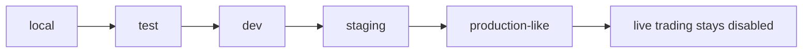

# Environment Strategy

Date: 2026-07-13
Scope: HYDRA Engineering Task A5

## Supported Environments

| Environment | Purpose | Allowed use | Explicitly out of scope |
| --- | --- | --- | --- |
| `local` | Single developer workstation | API startup, local migrations, local debugging, local Docker dependencies | live trading, exchange execution, real secrets in version control |
| `test` | Automated verification | unit tests, integration-style tests, CI validation | live trading, exchange execution, dependence on unmanaged external services |
| `dev` | Shared development infrastructure | team validation, shared service smoke checks, deployment rehearsal | production release, live trading, exchange execution |
| `staging` | Future-facing pre-release environment | release candidate verification, operational rehearsal, documentation checks | production commitments, live trading, exchange execution |
| `production-like` | Operational simulation only | resilience exercises, deployment simulation, runtime verification with scrubbed or synthetic data | any live exchange connectivity, trading, order routing, credential experimentation |

## Operating Rules

- `local` is the default profile for developer machines.
- `test` exists for automation and should stay deterministic.
- `dev` is the first shared environment and should use managed configuration, not hardcoded local overrides.
- `staging` is reserved for future pre-release validation and is not production.
- `production-like` is a simulation profile only. It must never imply live trading or exchange execution.

## Runtime Safety Baseline

- HYDRA does not expose a runtime flag that enables live trading.
- `HYDRA_SYSTEM_BLUEPRINT.live_trading_enabled` remains hardcoded to `False`.
- Environment naming is part of the configuration contract and fails validation when unsupported values are supplied.
- Environment example files are templates only; contributors must replace placeholders in local `.env` files.

## Environment Flow

