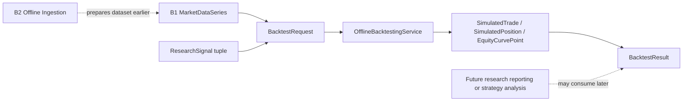

# Backtesting Skeleton

Date: 2026-07-18
Scope: HYDRA Engineering Task B3

## Purpose

B3 introduces HYDRA's first offline-first backtesting skeleton. Its purpose is
to simulate research decisions over an already validated `MarketDataSeries`
without adding trading execution, paper trading, infrastructure adapters, API
behavior, or live connectivity.

## Offline Backtesting Boundary

What B3 does:

- accepts offline `MarketDataSeries` as the backtest dataset
- accepts optional research signals with buy, sell, or hold intent
- simulates long-only trades in memory
- tracks simple cash, position, equity, and summary metrics
- returns a deterministic backtest result for local research

What B3 does not do:

- connect to an exchange, broker, or external service
- place or route orders
- manage wallets or real funds
- read files in production code
- write to a database
- expose API endpoints
- run background jobs or schedulers

## B1 and B2 Alignment

B3 builds directly on the existing domain and application boundaries.

Reused B1 market data concepts:

- `Symbol`
- `Market`
- `Timeframe`
- `OHLCVBar`
- `MarketDataSeries`
- `DataSourceDescriptor`

Reused B2 flow assumptions:

- dataset ingestion is already complete before backtesting starts
- B3 consumes validated offline series after the B2 ingestion boundary
- B3 does not duplicate record parsing, grouping, or normalization

## Domain Concepts

`src/hydra/domain/backtesting.py` defines pure Python backtesting concepts:

- `BacktestId`
- `BacktestTimeRange`
- `BacktestDirection`
- `ResearchSignal`
- `SimulatedTrade`
- `SimulatedPosition`
- `EquityCurvePoint`
- `BacktestMetrics`
- `BacktestResult`

These concepts intentionally use "research" and "simulated" vocabulary so the
model stays separate from live execution language.

## Application Service

`src/hydra/application/backtesting_dto.py` defines plain dataclass DTOs for:

- `BacktestRequest`
- `BacktestValidationError`
- `BacktestRunSummary`

`src/hydra/application/backtesting_service.py` provides
`OfflineBacktestingService`.

The service:

- validates request boundaries
- resolves the effective backtest time range
- filters signals against timestamps that exist in the offline dataset
- simulates long-only trades in memory
- calculates a simple equity curve, total return, and max drawdown
- returns a deterministic result summary without external IO

## Diagram

## Why It Remains Offline-First

B3 stays deterministic, synchronous, local, and offline-first because:

- it only works on in-memory domain objects
- it does not import infrastructure, adapters, or network clients
- it does not introduce background execution
- it does not imply real order submission or broker interaction

## Future Extension Path

Future milestones may add higher-level research capabilities on top of this
skeleton, such as:

- richer research signal generation from separate research modules
- scenario comparison or reporting outputs
- persistence ports for storing completed backtest reports

Those extensions must remain outside the current pure domain/application
boundary unless explicitly approved in a later sprint.

## Explicitly Not Implemented

- live trading
- paper trading
- Binance integration
- exchange adapters
- broker adapters
- exchange execution
- order routing
- wallet logic
- API keys
- WebSocket
- live market data collection
- database persistence
- API endpoints
- background workers
- AI strategy generation
- automatic trading
