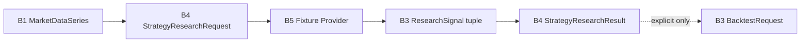

# Deterministic Fixture Strategy Provider

Date: 2026-07-18
Scope: HYDRA Engineering Task B5

## Purpose

B5 introduces HYDRA's first concrete offline strategy research provider. Its
job is narrow by design: consume a validated B4 `StrategyResearchRequest`,
apply a static fixture plan, and emit B3 `ResearchSignal` objects without
adding production strategy behavior.

This is a laboratory fixture provider, not a strategy engine.

## Position in the Architecture

- B1 provides `MarketDataSeries`, `OHLCVBar`, and offline source metadata
- B3 provides `ResearchSignal` and explicit backtest handoff types
- B4 provides `StrategyResearchProviderPort`, request DTOs, and orchestration
- B5 provides a concrete adapter implementing the B4 port

## Why This Is a Fixture Provider

The provider does not inspect price movement, detect patterns, or infer
signals from market behavior. Every emitted signal comes from an explicit
fixture instruction supplied at construction time.

That design keeps B5:

- deterministic across runs
- easy to test in memory
- safe for offline research
- suitable for validating port boundaries before real research adapters exist

## Fixture Instruction Design

`FixtureSignalInstruction` is a frozen dataclass with:

- `bar_index: int`
- `direction: BacktestDirection`
- `note: str | None = None`

Validation rules:

- `bar_index` must be an integer
- `bar_index` must be zero or greater
- `direction` must be a `BacktestDirection`
- `note` is stripped
- empty notes become `None`

## Deterministic Ordering

The provider accepts a tuple of instructions, defensively copies it, rejects
duplicate `bar_index` values, and stores instructions in ascending
`bar_index` order.

That means signal output ordering is deterministic even if construction input
is not.

## Time-Window Behavior

The provider respects `StrategyResearchRequest.start_timestamp` and
`end_timestamp` by first selecting bars inside the requested window and then
treating `bar_index` as relative to that selected tuple.

If an instruction points outside the selected bar window, the provider raises
a clear `ValueError`.

## Integration with B4

`OfflineStrategyResearchService` remains the application orchestrator.

The service:

- validates the request time range
- selects the effective market-data window
- calls the provider through `StrategyResearchProviderPort`
- validates returned `ResearchSignal` timestamps
- produces a `StrategyResearchResult`

B5 does not change that orchestration contract.

## Integration with B3

A successful `StrategyResearchResult` can be converted into a B3
`BacktestRequest` only through the explicit
`StrategyResearchResult.to_backtest_request(...)` handoff.

B5 does not trigger a backtest automatically.

## What Is Intentionally Not Implemented

- live trading
- paper trading
- Binance integration
- exchange adapters
- broker adapters
- exchange execution
- order routing
- wallet logic
- API keys
- WebSocket
- live market data collection
- database persistence
- API endpoints
- background workers
- AI strategy generation
- ML models
- automatic trading
- production strategy implementation
- moving-average strategy
- RSI strategy
- indicator engine
- optimizer

## Future Extension Boundary

Future offline research providers can build on the B4 port as long as they
preserve:

- offline-first behavior
- deterministic and testable boundaries where appropriate
- explicit handoff to B3
- no leakage into infrastructure, presentation, or execution concerns

B5 establishes the adapter seam without introducing production strategy logic.
