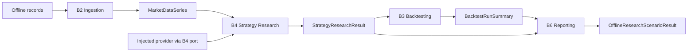

# End-to-End Offline Research Scenario

Date: 2026-07-19
Scope: HYDRA Engineering Task B7

## Purpose

B7 introduces HYDRA's first deterministic end-to-end offline research
scenario.

Its responsibility is narrow:

- accept a fixed offline record set
- run the approved in-memory research stages in order
- return one deterministic result object that carries each stage output

This is an application seam for research validation, not a production runner.

## How B7 Connects Earlier Milestones

- B1 provides the offline market data vocabulary
- B2 turns raw offline records into validated `MarketDataSeries`
- B4 uses `StrategyResearchProviderPort` to generate deterministic research
  signals
- B5 proves the B4 port can be satisfied with a deterministic fixture provider
  in tests
- B3 simulates the resulting backtest in memory
- B6 summarizes the completed backtest and research data into a report object

## Why This Is an Offline Scenario Seam

B7 does not schedule work, discover datasets, manage retries, or own runtime
coordination. It only binds together already-approved in-memory services for a
single deterministic scenario execution.

That means B7:

- is synchronous
- is local
- is deterministic
- preserves intermediate outputs
- does not reach outside the process

## Scenario Flow

1. Records enter the scenario request as `OfflineMarketDataRecord` values.
2. `OfflineMarketDataIngestionService` validates and groups those records into
   a single `MarketDataSeries`.
3. `OfflineStrategyResearchService` is created from the injected
   `StrategyResearchProviderPort`.
4. The strategy result is converted into a backtest request.
5. `OfflineBacktestingService` produces a deterministic `BacktestRunSummary`.
6. `OfflineResearchReportingService` produces a deterministic report summary.
7. `OfflineResearchScenarioResult` returns all successful stage outputs.

## Deterministic Behavior

B7 stays deterministic because:

- input records are explicit
- the provider is injected and can be deterministic
- all stages run in memory
- no wall-clock functions are used
- no files are read or written
- no network calls are made

The same request produces the same result object.

## Failure Behavior by Stage

B7 stops at the first failing stage and records a scenario error for that
stage.

- ingestion failures stop before strategy research
- strategy research failures stop before backtesting
- backtesting failures stop before report generation
- reporting failures return a reporting-stage error

## Partial Result Preservation

When a later stage fails, earlier successful stage outputs are preserved in
`OfflineResearchScenarioResult`.

Examples:

- if strategy research fails, the ingestion result is still returned
- if backtesting fails, both ingestion and strategy outputs are still returned
- if reporting fails, ingestion, strategy, and backtesting outputs are still
  returned

This keeps the seam useful for deterministic debugging and review without
introducing persistence.

## Why Application Code Must Not Import the B5 Concrete Provider

The B5 fixture provider is an adapter implementation used to prove the B4 port
contract in tests.

Production application code must depend on `StrategyResearchProviderPort`
instead so that:

- dependency direction stays aligned with Hexagonal Architecture
- application logic remains adapter-agnostic
- future provider implementations can be injected without changing the
  scenario service

## No Wall-Clock Dependency

B7 intentionally avoids `datetime.now`, `utcnow`, and similar wall-clock
calls. Timestamps come from the explicit request and from the existing
offline-record inputs.

## What Is Intentionally Not Implemented

- live trading
- paper trading
- Binance integration
- exchange adapters
- broker adapters
- exchange execution
- order routing
- wallet logic
- API keys
- WebSocket
- live market data collection
- database persistence
- API endpoints
- background workers
- scheduler
- CLI
- dashboard
- AI strategy generation
- ML models
- automatic trading
- production strategy implementation
- indicator engine
- optimizer
- chart rendering
- PDF export
- HTML export
- filesystem report writer

## Future Expansion Path

If HYDRA later needs richer scenario runners, batch research execution, or
transport-facing orchestration, that work should happen only after an explicit
ADR approves the new boundary and its side effects.
