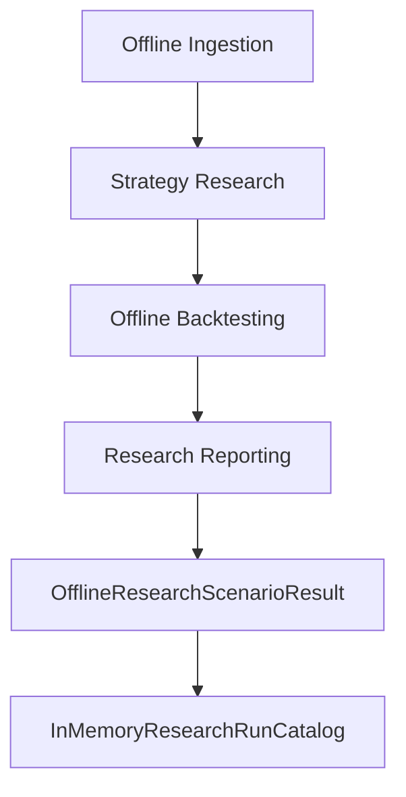

# In-Memory Research Run Catalog

Date: 2026-07-20
Status: Milestone C research usability note

## Purpose

Define the first Milestone C usability seam for working with already-produced
offline research scenario results during a single process lifetime.

## Scope

The in-memory research run catalog is an application-layer utility that can:

- add an `OfflineResearchScenarioResult`
- retrieve a stored run by `scenario_id`
- list stored runs in insertion order
- filter stored runs by existing metadata and metric availability
- compare stored runs using existing report/backtest metrics

It is intentionally process-local and deterministic.

## How It Builds On Milestone B

Milestone B already delivered:

- offline dataset ingestion
- deterministic strategy research
- offline backtesting
- research reporting
- end-to-end offline scenario orchestration

C1 does not replace or extend those flows. It sits after them and catalogs the
result objects they already produce.

## Why This Belongs To Milestone C

Milestone C focuses on research usability rather than new runtime integrations.
The catalog is the smallest useful seam that helps engineers understand what
research runs happened in the current process without adding persistence, APIs,
or exports.

## Catalog Responsibilities

### Add

- accept only existing `OfflineResearchScenarioResult` objects
- derive `scenario_id` and success status from the result
- reject duplicate IDs by default
- optionally replace an existing record when explicitly requested

### Get

- normalize the requested `scenario_id`
- return the stored run record or `None`
- keep internal storage encapsulated

### List

- return all records in insertion order when no query is provided
- filter by status, symbol, market, timeframe, report presence, and backtest
  presence when a query is supplied
- return immutable tuples only

### Compare

- count successful and failed runs
- identify the best total return
- identify the lowest max drawdown
- identify the highest trade count
- preserve deterministic earliest-insertion tie-breaking

## Metric Extraction Rules

`ResearchRunRecord` exposes metrics already present on the result object:

- prefer report-level values when a research report exists
- otherwise fall back to backtest-level values when available
- leave fields as `None` when the scenario did not produce the relevant data

This keeps C1 read-only with respect to prior Milestone B outputs.

## Deterministic Tie-Breaking

When comparison metrics tie, the catalog keeps the earliest inserted record as
the winner. This avoids randomness, wall-clock ordering, and implementation
surprises.

## Failure Behavior

- expected add-time validation problems return structured catalog errors
- failed scenario results can still be cataloged safely
- missing report/backtest data does not break listing or comparison
- the catalog never reruns research and never mutates prior result objects

## Limitations

- state is lost when the catalog instance is discarded
- no cross-process sharing exists
- no persistence, reporting surface, or user-facing endpoint is included
- the catalog is useful for in-process analysis only

## Explicit Non-Goals

- no live trading
- no paper trading
- no exchange integration
- no Binance integration
- no broker integration
- no API keys
- no WebSocket
- no external network calls
- no order execution
- no wallet logic
- no database persistence
- no file persistence
- no JSON persistence
- no CSV persistence
- no API endpoints
- no background workers
- no scheduler
- no CLI
- no dashboard
- no chart rendering
- no PDF export
- no HTML export
- no filesystem report writer
- no AI strategy generation
- no ML models
- no automatic trading

## Future Expansion Path

If later milestones prove a need for durable catalogs or external delivery
surfaces, HYDRA can add them deliberately through new ADRs and explicit
ports/adapters. C1 intentionally stops earlier so the first usability seam stays
small, deterministic, and architecture-safe.
