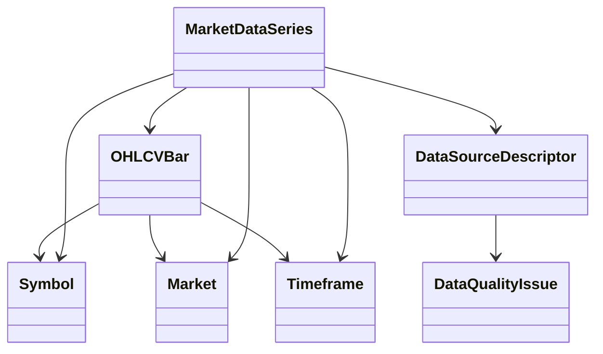

# Market Data Domain Model

Date: 2026-07-17
Scope: HYDRA Engineering Task B1

## Purpose

This document defines HYDRA's first exchange-agnostic market data language for
offline research workflows.

## Concepts

- `Symbol`: normalized instrument identifier kept as a small value object
- `Market`: normalized market segment descriptor such as `SPOT`
- `Timeframe`: supported bar interval enum
- `OHLCVBar`: one normalized market bar with validation on prices, volume, and timestamp
- `MarketDataSeries`: ordered bars for one symbol, market, and timeframe
- `DataQualityIssue`: explicit quality signal with type and message
- `DataSourceDescriptor`: metadata about an offline source and any known quality issues

## Domain Rules

- `Symbol` cannot be blank and is normalized safely with trim plus uppercase
- `Market` cannot be blank and is normalized safely with trim plus uppercase
- `Timeframe` is restricted to supported values only
- OHLC prices must be non-negative
- `high_price >= low_price`
- volume must be non-negative
- timestamps must be timezone-aware
- series members must stay ordered and aligned to one symbol, market, and timeframe

## Layer Ownership

What belongs in `domain/`:

- pure Python value objects
- enums
- validation rules
- ordering constraints
- source-neutral quality metadata

What belongs in `ports/`:

- offline repository contracts
- offline source contracts
- dependency boundaries for future adapters

What does not belong here yet:

- database repositories
- exchange SDK clients
- REST endpoints
- background workers
- schedulers
- cache wiring

## Model Diagram

## Explicitly Not Implemented Yet

- persistence implementation
- adapter mapping
- live ingestion
- scheduling
- API exposure

## Non-Goals

- live data collection
- Binance
- exchange API keys
- WebSocket
- trading
- order execution
- real-money operations
