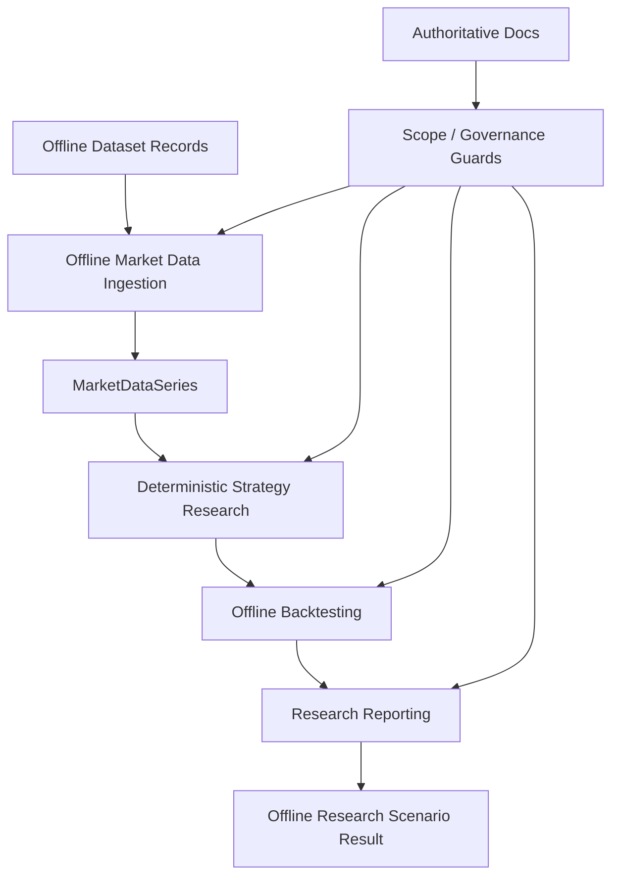

# Milestone B Final Review

Date: 2026-07-19
Status: Final hardening assessment for Milestone B

## Objective

Assess whether HYDRA's Milestone B implementation is coherent, offline-first,
and engineering-ready without introducing new product features.

## Reviewed Baseline

Milestone B was evaluated against:

- ADR-0001, ADR-0002, ADR-0004, ADR-0005, ADR-0006, ADR-0007
- B1-B7 research data documents
- B1-B7 review packages
- governance documents for Definition of Done, PR workflow, and Milestone B
  entry criteria
- CI and Security workflows
- architecture tests and local verification tooling

## Final Architecture Snapshot

## Findings

### 1. Scope discipline held

Milestone B remains offline-first and deterministic. No live market collection,
exchange adapter, trading workflow, WebSocket runtime, or real-money behavior
is part of the implemented path.

### 2. Architectural direction stayed consistent

The DDD + Hexagonal boundary defined in ADR-0001 still matches the B1-B7
implementation:

- the domain layer remains pure Python
- application services orchestrate domain behavior
- ports formalize external contracts
- adapters remain controlled and deterministic

### 3. Verification maturity improved materially

The final hardening pass focused on:

- deeper coverage of validation-heavy DTOs and domain models
- additional offline ingestion edge cases
- scenario/reporting DTO contract checks
- full local quality-gate execution

### 4. Repository messaging needed correction

The root `README.md` previously reflected an older architecture narrative that
mentioned paper trading and a pipeline no longer representative of Milestone B.
That inconsistency was corrected during the final hardening pass.

### 5. Workflow maintenance was appropriate

GitHub Actions updates were limited to upstream action version maintenance and
did not weaken CI or Security controls.

## Exit Assessment

Milestone B is now characterized by:

- deterministic offline research flow
- clear scope guardrails
- strengthened automated verification
- documentation aligned with current architecture

## Remaining Observations

- Coverage is strong on the active Milestone B path, while some non-core
  platform modules remain relatively less exercised.
- The next milestone should preserve the same discipline around offline-first
  scope boundaries and review evidence.

## Recommendation

Treat Milestone B as engineering-ready once the B8 PR evidence shows green CI
and Security results. Future work should build on the current offline research
foundation rather than reintroducing obsolete paper-trading or live-runtime
assumptions.
