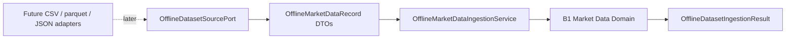

# Offline Dataset Ingestion

Date: 2026-07-17
Scope: HYDRA Engineering Task B2

## Purpose

B2 introduces HYDRA's first offline-first ingestion foundation for local or
static market datasets. Its job is to validate and normalize offline dataset
records into the B1 market data domain model without adding infrastructure,
database writes, HTTP behavior, or live connectivity.

## Boundary

What B2 does:

- defines offline dataset source contracts
- accepts raw offline bar-like records
- normalizes them into `OHLCVBar` and `MarketDataSeries`
- returns batch ingestion results and validation errors
- keeps partial batch failures visible without crashing the whole ingestion flow

What B2 does not do:

- read files from disk in production code
- call exchanges or network APIs
- write to a database
- expose API endpoints
- run background jobs

## B1 Reuse

B2 builds on the B1 market data domain model instead of replacing it.

Reused B1 concepts:

- `Symbol`
- `Market`
- `Timeframe`
- `OHLCVBar`
- `MarketDataSeries`
- `DataSourceDescriptor`

This means dataset ingestion does not redefine market rules. It delegates
validation to the domain and reports failures through application result
objects.

## Ports

`src/hydra/ports/offline_dataset.py` defines:

- `OfflineDatasetSourcePort`

The port is intentionally offline-first and only describes:

- source metadata via `describe_source`
- discoverable dataset names via `list_available_datasets`
- raw record loading via `load_records`

No filesystem, CSV, parquet, JSON, database, or external service
implementation exists in B2. Those remain future adapter concerns.

## Application Flow

`src/hydra/application/market_data_ingestion_service.py` provides the
offline ingestion use case.

The service:

- accepts an `OfflineDatasetIngestionRequest`
- loads records from an offline source port or uses records passed directly
- normalizes string or primitive values into domain-safe types
- groups valid bars by `symbol + market + timeframe`
- builds `MarketDataSeries` for each valid group
- reports invalid rows or invalid groups through
  `OfflineDatasetIngestionError`

## DTOs

`src/hydra/application/market_data_ingestion_dto.py` defines:

- `OfflineMarketDataRecord`
- `OfflineDatasetIngestionRequest`
- `OfflineDatasetIngestionResult`
- `OfflineDatasetIngestionError`

These DTOs are plain dataclasses. They do not depend on FastAPI, Pydantic,
SQLAlchemy, Redis, or adapters.

## Grouping Behavior

B2 intentionally groups mixed offline datasets by normalized:

- symbol
- market
- timeframe

This keeps multi-series offline datasets usable while still enforcing strict
domain validation inside each resulting `MarketDataSeries`.

If a group contains unordered bars or invalid values, the affected group is
reported as an ingestion error and omitted from the successful series output.

## Diagram

## Future Extension Path

Future adapters may plug into `OfflineDatasetSourcePort` for:

- CSV readers
- parquet readers
- JSON readers
- fixture-backed import tools

Those adapters must stay outside the application and domain layers. B2 only
defines the boundary they would target later.

## Explicitly Not Implemented

- production CSV readers
- production parquet readers
- production JSON readers
- database persistence
- repository writes
- API routes
- FastAPI integration
- background workers
- schedulers

## Non-Goals

- live market data collection
- Binance integration
- exchange adapters
- WebSocket
- API keys
- trading
- order execution
- real-money operations
- database persistence
- API endpoints
- background workers
