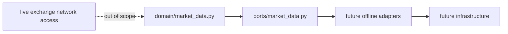

# Offline First Data Policy

Date: 2026-07-17
Scope: HYDRA Engineering Task B1

## Policy

HYDRA market data work starts from offline artifacts and domain validation
instead of live connectivity. Future ingestion flows must normalize data into
domain objects before any adapter or persistence implementation is considered.

## Rules

- offline files are the primary source for current market data modeling work
- domain objects must stay exchange-agnostic
- ports must describe offline loading and storage, not live retrieval
- application or adapter work may begin only after domain contracts are stable
- documentation must state when a capability is still intentionally absent

## Why Live Collection Is Out of Scope

- live collectors would introduce network, scheduling, and operational concerns
- exchange APIs would force premature vendor decisions
- the current sprint is meant to stabilize language and validation rules first
- branch-governed Milestone B work prioritizes safe, reviewable increments

## Why Exchange-Specific Adapters Are Out of Scope

- they would leak vendor semantics into the core model too early
- they would complicate tests with connectivity and credential assumptions
- they would bypass the ports-before-adapters discipline established in ADR-0001

## Boundary Diagram

## Non-Goals

- live data collection
- Binance
- exchange API keys
- WebSocket
- trading
- order execution
- real-money operations
