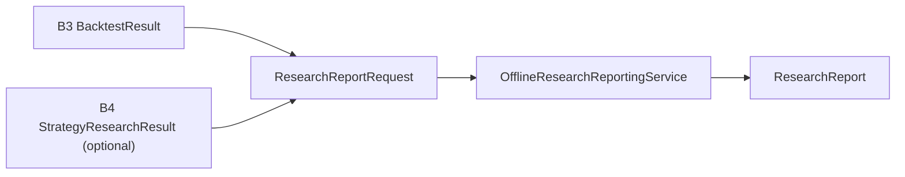

# Research Reporting Foundation

Date: 2026-07-18
Scope: HYDRA Engineering Task B6

## Purpose

B6 introduces HYDRA's first offline research reporting foundation. Its job is
to convert already computed in-memory research outputs into a deterministic
`ResearchReport` object.

This is reporting in memory, not exporting.

## Why This Stays In Memory

B6 exists to define a stable report language before any future renderer,
dashboard, exporter, or persistence boundary is considered.

That means B6:

- does not write files
- does not create PDFs
- does not create HTML
- does not create Markdown exports
- does not render charts
- does not expose endpoints
- does not persist reports

## Architectural Position

B6 is downstream of the existing Milestone B foundations.

- B1 provides the market-data language and source metadata
- B2 provides the offline ingestion boundary that prepares data earlier
- B3 provides `BacktestResult` and simulation summaries
- B4 provides optional `StrategyResearchResult` summaries
- B5 proves deterministic research signal generation through a fixture provider
- B6 summarizes the completed outputs into report value objects

## Report Object Structure

`ResearchReport` contains:

- identity through `ResearchReportId`
- dataset scope through `backtest_id`, `symbol`, `market`, `timeframe`, and
  `time_range`
- optional source metadata through `DataSourceDescriptor`
- deterministic summaries for metrics, equity, signals, trades, and risk
- optional normalized title and notes

There is intentionally no `generated_at` field in B6. Report construction does
not depend on the wall clock.

## Metric Snapshot

`MetricSnapshot` copies key B3 result metrics into a stable summary:

- initial cash
- ending cash
- ending equity
- total return
- max drawdown
- trade count
- backtest signal count

## Equity Curve Summary

`EquityCurveSummary` condenses the full equity curve into summary values:

- point count
- first and last timestamps
- starting and ending equity
- minimum and maximum equity
- lowest cash observed
- highest position quantity observed

This keeps B6 lightweight while still reflecting the shape of the backtest
trajectory.

## Signal Summary

`SignalSummary` always includes the B3 backtest signal count.

When a B4 `StrategyResearchResult` is supplied, it also includes:

- research signal count
- rejected signal count
- research error count
- buy signal count
- sell signal count
- hold signal count

B6 does not fail solely because the optional research result contains errors.
It reports the error count instead.

## Simulated Trade Summary

`SimulatedTradeSummary` condenses B3 simulated trades into:

- total trade count
- buy count
- sell count
- first trade timestamp
- last trade timestamp

No trade-level enrichment or rendering is added.

## Risk Snapshot

`RiskSnapshot` captures:

- max drawdown
- total return
- whether the final position remains open
- final position quantity
- final position average entry price

This keeps the report useful for downstream review without re-running the
backtest.

## Deterministic Behavior

B6 is deterministic because:

- it uses only already computed input objects
- it does not call external services
- it does not read or write files
- it does not use wall-clock functions
- it produces the same report for the same input

## What Is Intentionally Not Implemented

- live trading
- paper trading
- Binance integration
- exchange adapters
- broker adapters
- exchange execution
- order routing
- wallet logic
- API keys
- WebSocket
- live market data collection
- database persistence
- API endpoints
- background workers
- AI strategy generation
- ML models
- automatic trading
- production strategy implementation
- indicator engine
- optimizer
- chart rendering
- PDF export
- HTML export
- filesystem report writer
- dashboard

## Future Expansion Path

Future milestones may add:

- exporters targeting PDF, HTML, or other render formats
- dashboard adapters
- persisted report storage
- richer comparison and multi-run research views

Those extensions should happen only after an explicit ADR approves the
additional boundary and side effects.
