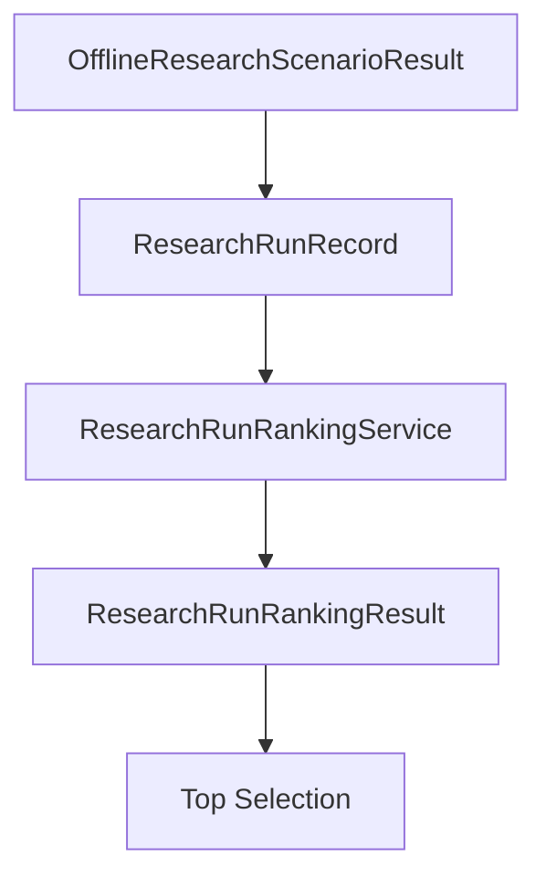

# Research Run Ranking and Selection

Date: 2026-07-20
Status: Milestone C research usability note

## Purpose

Define the second Milestone C usability seam for deterministically ranking and
selecting already-cataloged research runs.

## Scope

The C2 ranking service is an application-layer utility that can:

- rank existing `ResearchRunRecord` values by a selected metric
- apply deterministic eligibility criteria
- expose stable exclusion reasons
- return the top ranked run
- keep results independent from catalog storage

It is intentionally process-local, deterministic, and read-only with respect to
the underlying records.

## How It Builds On C1

C1 introduced:

- `ResearchRunRecord`
- `ResearchRunStatus`
- process-local catalog storage
- deterministic listing and comparison summaries

C2 does not replace cataloging. It consumes the C1 record objects and turns
them into ranking results and top-run selections.

## Why This Belongs To Milestone C

Milestone C is focused on research usability seams. C2 adds deterministic
selection logic without introducing persistence, APIs, dashboards, or runtime
infrastructure.

## Ranking Responsibilities

- accept any iterable of `ResearchRunRecord` values
- remain independent from `InMemoryResearchRunCatalog`
- evaluate eligibility filters before ranking
- extract only already-available C1 metrics
- sort with stable input-order tie-breaking
- expose limited top-N slices without treating omitted lower-ranked records as
  failures

## Supported Metrics

- `TOTAL_RETURN`
- `MAX_DRAWDOWN`
- `TRADE_COUNT`
- `SIGNAL_COUNT`

## Default Metric Directions

- `TOTAL_RETURN`: higher first
- `MAX_DRAWDOWN`: lower first
- `TRADE_COUNT`: higher first
- `SIGNAL_COUNT`: higher first

## Eligibility Criteria

The service can filter by:

- run status
- symbol
- market
- timeframe
- report availability
- backtest availability
- minimum and maximum total return
- minimum and maximum max drawdown
- minimum and maximum trade count
- minimum and maximum signal count

By default, eligibility prefers successful runs only unless explicitly
overridden.

## Exclusion Behavior

Records may be excluded for deterministic reasons such as:

- status mismatch
- symbol mismatch
- market mismatch
- timeframe mismatch
- missing report
- missing backtest
- missing metric
- below minimum threshold
- above maximum threshold

These exclusions are explicit result data rather than side effects.

## Deterministic Tie-Breaking

When metric values tie, the earliest input record wins. This keeps rankings
stable and avoids randomness or hidden time-based ordering.

## Selection Behavior

`select_best(...)` reuses the same ranking logic as `rank(...)` and returns the
top ranked entry or `None` when no eligible entry exists.

## Limitations

- ranking state is not persisted
- lower-ranked eligible records may be omitted from returned entries when a
  limit is applied
- no multi-metric weighting or optimizer behavior exists in C2
- no external delivery surface is included

## Explicit Non-Goals

- no live trading
- no paper trading
- no exchange integration
- no Binance integration
- no broker integration
- no API keys
- no WebSocket
- no external network calls
- no order execution
- no wallet logic
- no database persistence
- no file persistence
- no JSON persistence
- no CSV persistence
- no API endpoints
- no background workers
- no scheduler
- no CLI
- no dashboard
- no chart rendering
- no PDF export
- no HTML export
- no filesystem report writer
- no AI strategy generation
- no ML models
- no automatic trading

## Future Expansion Path

If later milestones require weighted ranking, durable storage, or new delivery
surfaces, HYDRA can add them through new ADRs and explicit ports/adapters. C2
intentionally stops at deterministic in-process selection logic.
