# A1 CI CD Report

Date: 2026-07-09
Scope: GitHub Actions workflow, lockfile usage, and build validation path
Final Verdict: PASS WITH WARNINGS

## What Changed

A1 added a repository CI workflow in `.github/workflows/ci.yml` that runs on every push and pull request. The workflow installs dependencies with `uv`, runs linting and typing checks, executes tests, validates Alembic configuration, and builds the Docker image.

## Evidence

- `.github/workflows/ci.yml`
- `uv.lock`
- `pyproject.toml`
- `Dockerfile`
- `tools/validate_alembic.py`
- `docs/engineering/CI Pipeline.md`

CI stage diagram:

```mermaid
flowchart LR
    A["push / pull_request"] --> B["actions/checkout"]
    B --> C["setup-python 3.12"]
    C --> D["setup-uv"]
    D --> E["uv sync --frozen --group dev"]
    E --> F["uv run ruff check ."]
    F --> G["uv run black --check ."]
    G --> H["uv run mypy src tests tools"]
    H --> I["uv run pytest --cov-report=xml"]
    I --> J["uv run python tools/validate_alembic.py"]
    J --> K["docker build -t hydra-ci ."]
```



## Commands Executed

```powershell
git status --short --branch
uv run ruff check .
uv run black --check .
uv run mypy src
uv run pytest
uv run python tools/validate_alembic.py
docker build .
```

## Command Results

- The workflow definition exists and is internally coherent with the A1 acceptance criteria.
- Local gate commands passed except for `docker build .`, which failed because Docker is not installed on this workstation.
- `git status --short --branch` reported `## main...origin/main [ahead 1]` before this review package was created, which means the A1 hardening commit existed locally but did not yet provide remote CI evidence in this environment.

Local Docker failure excerpt:

```text
docker : The term 'docker' is not recognized as the name of a cmdlet, function,
script file, or operable program.
```

Assessment: the CI definition is present and appears correct, but this review cannot claim empirical GitHub Actions success from the local workstation alone.

## Remaining Risks

- No GitHub Actions run log was available in this session because the local branch had not yet been pushed from this workstation state.
- Docker build success is still inferred from configuration quality, not proven locally.
- The CI workflow uses the stricter Mypy command, while the user-requested local command here was `uv run mypy src`; that is acceptable for this review, but the difference should remain explicit.

## Recommended Next Actions

1. Push the branch and capture the first successful GitHub Actions run URL in the next review update.
2. Run `docker build .` on a host with Docker installed to confirm local parity with CI expectations.
3. Consider adding a status badge or release checklist once CI has a stable remote history.
