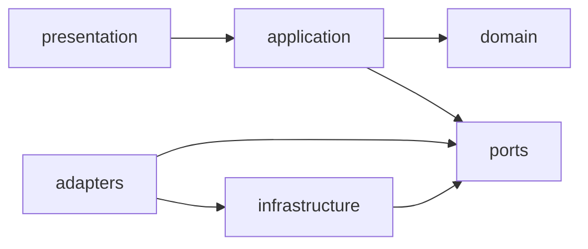

# A1 Architecture Fitness Report

Date: 2026-07-09
Scope: DDD plus Hexagonal Architecture rule enforcement
Final Verdict: PASS

## What Changed

A1 converted architecture expectations from documentation-only guidance into executable tests. The repository now enforces forbidden imports and dependency direction rules across `domain`, `application`, `presentation`, `adapters`, and `infrastructure`.

## Evidence

- `docs/adr/ADR-0001-hexagonal-architecture.md`
- `docs/engineering/Engineering Standards.md`
- `tests/test_architecture_layers.py`
- `tests/test_alembic_validation.py`
- `src/hydra/domain/`
- `src/hydra/application/`
- `src/hydra/ports/`
- `src/hydra/adapters/`
- `src/hydra/infrastructure/`
- `src/hydra/presentation/`

Boundary diagram:



## Commands Executed

```powershell
uv run pytest
uv run mypy src
uv run python tools/validate_alembic.py
```

## Command Results

Architecture fitness passed through the main test suite.

Validated rules from `tests/test_architecture_layers.py`:

- domain does not import FastAPI, SQLAlchemy, Redis, Pydantic, or `pydantic_settings`
- application does not import FastAPI or SQLAlchemy
- application internal dependencies stay within `application`, `domain`, and `ports`
- presentation internal dependencies stay within `presentation` and `application`
- presentation does not import ORM models directly
- infrastructure internal dependencies stay within `infrastructure` and `ports`
- discovered adapter classes implement a runtime port

Observed suite result:

```text
10 passed in 3.39s
```

Assessment: PASS. The repository now has enforceable guardrails against the most important boundary regressions described in ADR-0001.

## Remaining Risks

- Adapter-to-port enforcement is currently narrow and centered on `RuntimeSettingsPort`; future ports will need their own checks.
- Import-based architecture tests cannot catch all semantic leaks, such as hidden framework behavior exposed through helper wrappers.
- The review did not discover direct boundary violations, but ongoing discipline is still required as new modules are introduced.

## Recommended Next Actions

1. Extend adapter compliance tests when new ports or repository interfaces are introduced.
2. Add a smoke test for composition-root wiring once more infrastructure adapters exist.
3. Keep architecture rules synchronized between ADR-0001, engineering standards, and executable tests.
