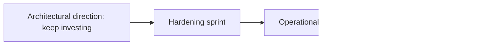

# Executive Summary

Date: 2026-07-09
Audience: CTO, technical leadership, lead engineer

## Bottom Line

HYDRA is on the right architectural trajectory but is not yet on a production-ready operating footing. The refactor to DDD plus Hexagonal Architecture materially improved structural clarity, testable boundaries, and future maintainability. However, the repository still behaves like a well-organized platform scaffold rather than a fully operational product foundation.

The correct executive decision is:

- Continue investment: Yes
- Accelerate feature development immediately: No
- Treat as production-ready: No
- Enter a foundation-hardening phase: Yes

## Current Maturity Snapshot

| Dimension | Rating | CTO Interpretation |
| --- | --- | --- |
| Product scope discipline | Strong | Non-goals are explicit and the team is resisting premature live trading scope. |
| Architecture direction | Strong | The codebase now has a coherent target architecture with clear dependency intent. |
| Implementation depth | Moderate | Structure exists, but application depth and persistence use cases are still shallow. |
| Test posture | Moderate | Better than a raw scaffold, but still too thin for aggressive change velocity. |
| Delivery engineering | Weak | No visible CI/CD, quality gates, or automated release controls in the repo. |
| Observability | Weak | Logging exists, but auditability, metrics, traces, and runtime diagnostics are minimal. |
| Security governance | Weak | No visible security policy, secret rotation guidance, or supply-chain controls. |
| Production readiness | Weak | Good platform direction, insufficient operating controls. |

## Strategic Assessment

HYDRA is currently best understood as:

- a strong architectural seed,
- a controlled research-platform foundation,
- not yet an operations-ready internal platform,
- and not yet a production service.

The refactor was valuable because it reduced the chance that future features would be built directly into framework and persistence layers. That matters. It means the team can add use cases later without paying an immediate architectural rewrite tax. The codebase is therefore investable.

What is still missing is the second half of CTO responsibility:

- delivery system rigor,
- operational guardrails,
- production-quality observability,
- and governance around changes, releases, and security.

## Recommended Executive Posture

Use a two-speed leadership stance:

1. Protect the new architecture.
   Reason: the architectural direction is the project's strongest asset right now.

2. Slow feature scope until the operating baseline catches up.
   Reason: without stronger CI/CD, release discipline, observability, and security controls, new features will increase complexity faster than confidence.

## The Three Most Important CTO Calls

1. Declare the next phase a platform-hardening milestone rather than a feature milestone.
2. Require every new change to preserve the hexagonal layer boundaries.
3. Fund CI/CD, observability, and delivery governance before expanding the product surface.

## Recommended Status

## Executive Recommendation

Proceed with controlled confidence. Do not pivot away from the current architecture. Do not scale delivery expectations yet. Treat the next 90 days as the period in which HYDRA becomes a credible engineering platform rather than only a promising code structure.
