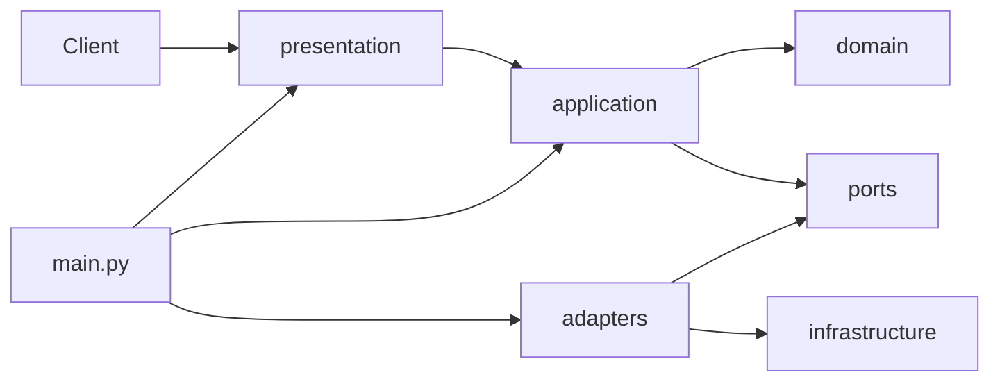

# Technology And Architecture Review

Date: 2026-07-09

## Architecture Position

HYDRA now reflects a recognizable hexagonal structure:

- `domain/` contains pure Python business concepts
- `application/` contains use-case level response orchestration
- `ports/` define contracts
- `adapters/` implement framework-facing details
- `infrastructure/` owns configuration, logging, and database primitives
- `presentation/` owns FastAPI routes
- `main.py` acts as the composition root

This is a meaningful improvement over the original scaffold and is the strongest technical outcome in the repository today.

## Current Architecture Diagram

## Architectural Strengths

1. Layer boundaries are now explicit in the source tree, which reduces accidental framework-first design.
2. `domain/` is framework-free, which is exactly the right long-term direction for research, simulation, and decision logic.
3. `application/services.py` creates a clean place for use-case orchestration and future business workflows.
4. `presentation/` has been narrowed to HTTP concerns, which will help maintain external behavior while evolving internals.
5. Architecture tests now exist and directly protect dependency direction.

## Architectural Gaps

1. The application layer is still thin.
   It currently shapes system metadata responses rather than real business workflows. The architecture is valid, but its most important paths are not yet exercised by non-trivial use cases.

2. Persistence remains adapter-heavy without a repository abstraction layer in active use.
   `adapters/sqlalchemy_models.py` contains the ORM records, but there are not yet repository ports or mapper services in the main request flow.

3. Runtime composition is only partially centralized.
   `main.py` is a composition root, which is good, but there is still no broader bootstrapping pattern for background jobs, CLI tasks, or migration-safe runtime wiring.

4. The domain model currently captures structural entities more than domain behavior.
   This is acceptable at this stage, but future complexity should go into domain policies and value objects rather than back into adapters or presentation.

5. Some project documents are now stale relative to the current structure.
   The earlier architecture review references packages that were removed during the refactor. That is a documentation governance issue, not a code issue, but it matters for architectural trust.

## Technology Stack Assessment

| Area | Current Choice | Assessment |
| --- | --- | --- |
| API framework | FastAPI | Good fit for a research platform API. |
| Persistence | PostgreSQL + SQLAlchemy + Alembic | Sound default stack. |
| Cache / ephemeral store | Redis | Sensible placeholder, though not yet operationally integrated. |
| Packaging | `uv` + `pyproject.toml` | Good modern choice. |
| Runtime containerization | Docker + Compose | Correct for local infrastructure parity. |
| Testing | Pytest | Strong baseline, current coverage still modest. |

## Architectural Debt

1. The architecture direction is ahead of the implementation depth.
2. ORM records and domain entities coexist without an active mapping strategy in business flows.
3. The Docker image does not currently use `uv.lock` during build, which weakens reproducibility.
4. Migration configuration reaches through an adapter to load runtime settings, which is workable but still a coupling hotspot.
5. Logging remains infrastructure-only and not yet platform-grade.

## CTO View

This is an architecture that should be preserved, not replaced. The risk is not that the team chose the wrong structure. The risk is that the team stops halfway and begins adding features before the new structure has supporting discipline around it.

## CTO Recommendation

The architecture should be treated as the project's protected backbone. Every near-term engineering decision should answer one question:

Does this deepen the hexagonal design, or does it leak framework and persistence concerns back inward?

If the answer is the second, it should be blocked.
