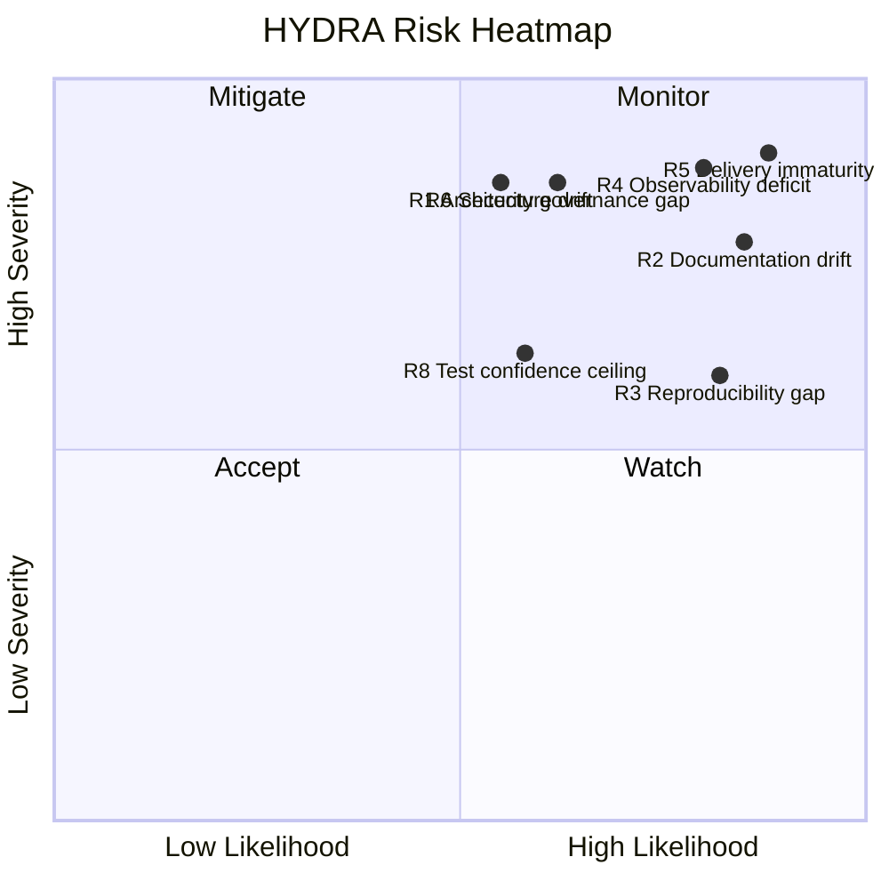

# Risk Register

Date: 2026-07-09

## Summary

The current risk profile is manageable if addressed early. The dominant risk is not feature failure. It is governance drift: architecture, delivery discipline, observability, and documentation can all erode quickly if the team starts building breadth before the platform baseline is hardened.

## Risk Table

| ID | Risk | Severity | Likelihood | Evidence | Mitigation |
| --- | --- | --- | --- | --- | --- |
| R1 | Architecture drift back into framework-first code | High | Medium | New structure is strong, but still young and only lightly exercised | Keep architecture tests mandatory and add import-boundary checks in CI |
| R2 | Documentation drift | High | High | `docs/` is the source of truth, but an earlier architecture review still references removed package paths | Establish document ownership and update cadence after each structural change |
| R3 | Reproducibility gap in container builds | Medium | High | `uv.lock` exists, but `Dockerfile` does not copy it into the build | Build from lock file and validate in CI |
| R4 | Observability deficit | High | High | Logging is basic; no metrics, tracing, request correlation, or audit trail are visible | Introduce structured logging, correlation IDs, and operational telemetry baseline |
| R5 | Delivery pipeline immaturity | High | High | No visible CI workflow, release gates, or deployment automation in the repository | Add automated test, lint, migration, and container validation pipeline |
| R6 | Security governance gap | High | Medium | No visible `SECURITY.md`, SBOM, dependency scanning, or secret handling standard | Add security policy, dependency scanning, and release security checklist |
| R7 | Persistence and domain divergence | Medium | Medium | Domain entities and ORM records are separated, but mapping discipline is not yet operationalized | Add mapper/repository patterns only when business workflows begin using persistence |
| R8 | Test confidence ceiling | Medium | Medium | Tests pass, but the functional surface is still narrow | Expand tests around configuration, migrations, and future application use cases |
| R9 | Migration/runtime coupling hotspot | Medium | Medium | `alembic/env.py` loads runtime settings via adapter path | Keep migration wiring minimal and document migration execution model |
| R10 | Premature scope expansion | High | Medium | Architecture is ready sooner than operations are | Freeze new platform surface until hardening milestones are met |

## Risk Heatmap

## Top Three Risks To Escalate Weekly

1. R5 Delivery pipeline immaturity
2. R4 Observability deficit
3. R2 Documentation drift

## CTO View

None of these risks is unusual for an early platform. What matters is response speed. If these are left unmanaged while features grow, they will convert from manageable platform debt into systemic delivery drag.

