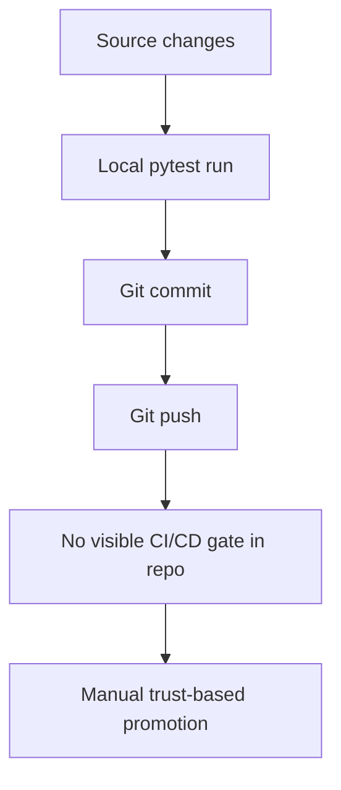

# Delivery And Operations Review

Date: 2026-07-09

## Delivery Readiness Assessment

| Capability | Status | Assessment |
| --- | --- | --- |
| Source control hygiene | Good | Repository is versioned and recent structural work has been committed cleanly. |
| Dependency management | Good | `pyproject.toml` and `uv.lock` are present. |
| Local test execution | Good | Local test suite passes. |
| Architecture guardrails | Good | Import-boundary tests exist and are valuable. |
| CI automation | Missing | No visible CI workflow is present in the repository. |
| Release automation | Missing | No release pipeline or promotion flow is visible. |
| Container reproducibility | Partial | Docker exists, but build currently resolves without the lock file. |
| Observability baseline | Weak | Logging exists, but operations telemetry is minimal. |
| Security program artifacts | Missing | No visible policy, scanning, or security workflow files. |
| Runbooks and SLOs | Missing | No visible service operations playbook exists. |

## Current Delivery Flow

## Operational Review

### What Is Working

1. The project has a coherent local developer setup.
2. Local infrastructure choices are sensible for the target platform.
3. The repository already includes migration tooling and container definitions.

### What Is Missing

1. No visible automated release gate
2. No deployment manifest beyond local Compose
3. No operational metrics strategy
4. No tracing or correlation strategy
5. No alerting, SLO, or incident process documentation
6. No explicit backup or restore playbook for PostgreSQL
7. No environment promotion model across dev, staging, and prod-like targets

## Security And Governance Review

Based on the repository contents alone, the following items are not yet visible:

- `SECURITY.md`
- secret management policy
- dependency vulnerability scanning workflow
- SBOM or build provenance guidance
- branch protection policy documentation
- incident response or access review guidance

This does not mean the organization lacks these controls elsewhere. It does mean they are not part of the repository's operational contract today.

## CTO Recommendation

Before HYDRA is treated as a production-track platform, it needs a minimum operating system around the codebase:

1. CI validation on every push
2. Locked and reproducible container build
3. Security review checklist
4. Structured logging and telemetry baseline
5. Runbooks for migrations, startup, rollback, and recovery

## Release Readiness Verdict

Current verdict: Not release-ready for production-like usage.

Permitted posture:

- safe for continued internal architectural development
- safe for controlled local and dev-environment evolution
- not yet safe for operational dependency by other teams or production consumers
