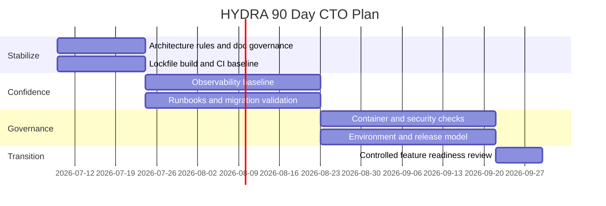

# 90 Day CTO Plan

Date: 2026-07-09

## Objective

Turn HYDRA from a promising architectural scaffold into a delivery-capable, governance-backed engineering platform without expanding scope into new business features.

## Phase Plan

### Days 0-15: Stabilize The Backbone

Goals:

- freeze architectural boundaries
- prevent drift
- close obvious reproducibility and documentation gaps

Actions:

1. Define the CTO-approved architectural ruleset for all future merges.
2. Mark the current CTO review package as the canonical leadership review bundle.
3. Update or retire stale review documents that still reference removed package paths.
4. Add a build step that uses `uv.lock` in container builds.
5. Add a basic CI workflow that runs tests and validates the package import path.

Exit criteria:

- CI exists and runs on every push
- documentation ownership is assigned
- architectural rules are enforced in the repository

### Days 16-45: Build Operational Confidence

Goals:

- improve trust in changes
- establish runtime visibility
- reduce manual release risk

Actions:

1. Introduce structured logging format and correlation IDs.
2. Add migration verification to CI.
3. Add configuration override tests and startup-path tests.
4. Document operational runbooks for startup, migration, rollback, and recovery.
5. Create a minimum security checklist for releases.

Exit criteria:

- every merge runs automated tests
- migrations are validated
- operational runbooks exist
- basic observability posture is in place

### Days 46-75: Harden Delivery Governance

Goals:

- make the platform safe for a faster development cadence
- reduce leadership uncertainty about release quality

Actions:

1. Add container build validation in CI.
2. Add dependency scanning or equivalent supply-chain check.
3. Add test coverage around future application-layer growth points.
4. Formalize environment strategy across local, dev, and future staging targets.
5. Define release and rollback ownership.

Exit criteria:

- container build is validated automatically
- security checks exist in the engineering workflow
- release ownership is explicit

### Days 76-90: Prepare For Controlled Feature Expansion

Goals:

- unlock future roadmap delivery without damaging the architecture

Actions:

1. Review whether the application layer is ready for repository ports and real use cases.
2. Reassess the risk register and close or downgrade the top three risks.
3. Decide whether HYDRA graduates from foundation phase to controlled feature phase.

Exit criteria:

- architecture remains intact under delivery pressure
- top operational risks are materially reduced
- leadership can approve the next roadmap tranche with evidence

## Roadmap Diagram

## Metrics The CTO Should Track Weekly

1. Test pass rate on primary branch
2. Number of undocumented architectural changes
3. Count of unresolved high-severity platform risks
4. CI duration and failure rate once CI exists
5. Number of runbooks completed versus planned

## Final Recommendation

Do not expand product scope during this 90-day window. Use the period to finish the engineering system around the architecture. If that work is done well, HYDRA will become a much safer platform to grow.
