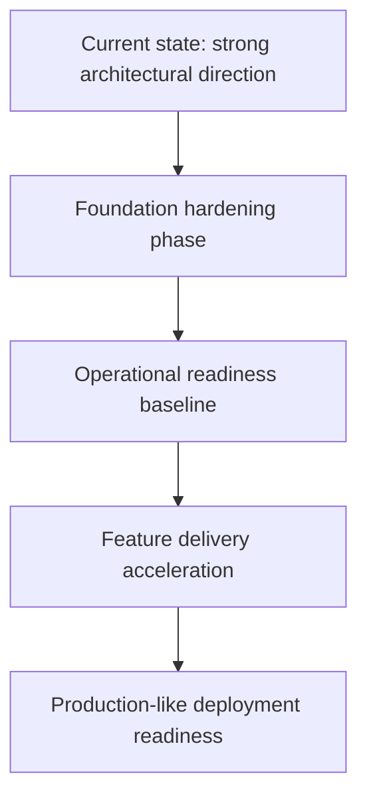

# HYDRA CTO Review Package

Date: 2026-07-09
Scope: Repository-wide CTO review package for the current `main` branch
Repository State Reviewed: `c5212c3`

## Purpose

This package provides a decision-ready CTO review of HYDRA after the Domain-Driven Design plus Hexagonal Architecture refactor. It is intended to answer four questions:

1. Is the architecture direction sound?
2. Is the repository ready for accelerated feature delivery?
3. Is the system operationally ready for production-like usage?
4. What should the next 90 days prioritize?

## Executive Verdict

- Architecture direction: Green
- Codebase foundation maturity: Yellow
- Delivery maturity: Yellow
- Production readiness: Red
- Security and operational governance: Red

Recommendation:

Proceed, but only as a controlled foundation-hardening phase. HYDRA is not ready for production deployment or aggressive feature acceleration yet. The right next move is not feature expansion; it is architectural consolidation, operational hardening, and governance completion.

## Package Contents

1. [01 Executive Summary](H:\hydra\docs\reviews\cto_review_package\01_executive_summary.md)
2. [02 Technology And Architecture Review](H:\hydra\docs\reviews\cto_review_package\02_technology_and_architecture_review.md)
3. [03 Risk Register](H:\hydra\docs\reviews\cto_review_package\03_risk_register.md)
4. [04 Delivery And Operations Review](H:\hydra\docs\reviews\cto_review_package\04_delivery_and_operations_review.md)
5. [05 90 Day CTO Plan](H:\hydra\docs\reviews\cto_review_package\05_90_day_cto_plan.md)

Supporting documents already present in the repository:

- [ADR-0001](H:\hydra\docs\adr\ADR-0001-hexagonal-architecture.md)
- [Architecture Review v1](H:\hydra\docs\reviews\architecture_review_v1.md)
- [Refactor Report](H:\hydra\docs\reviews\refactor_report.md)

## Evidence Base

This package is based on the current repository contents, including:

- SDS documents under `docs/`
- Current source layout under `src/hydra/`
- Alembic configuration and migration files
- Docker packaging and Compose setup
- Tests under `tests/`
- Current local verification run: `7 passed, 1 warning`

## Decision Snapshot

## Key Messages For The CTO

1. The refactor moved HYDRA onto a healthier architectural path. The domain, application, ports, adapters, infrastructure, and presentation boundaries are now explicit.
2. The codebase is still an early-stage scaffold. It has structure, not yet delivery depth.
3. The biggest remaining gaps are not in business logic. They are in observability, CI/CD, security governance, reproducible builds, and persistence/application integration depth.
4. The highest-leverage investment is a 60-90 day hardening sprint, not new feature breadth.
5. Existing review documents now need governance attention because one earlier architecture review references pre-refactor package paths and should no longer be treated as the current architecture map.

