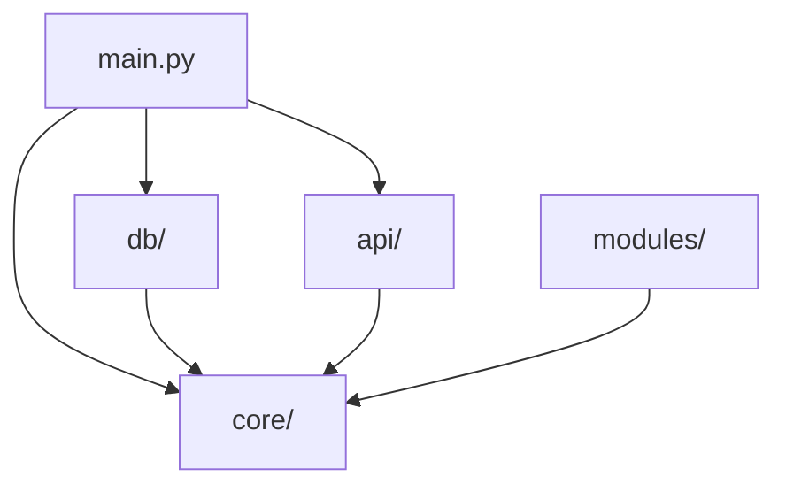
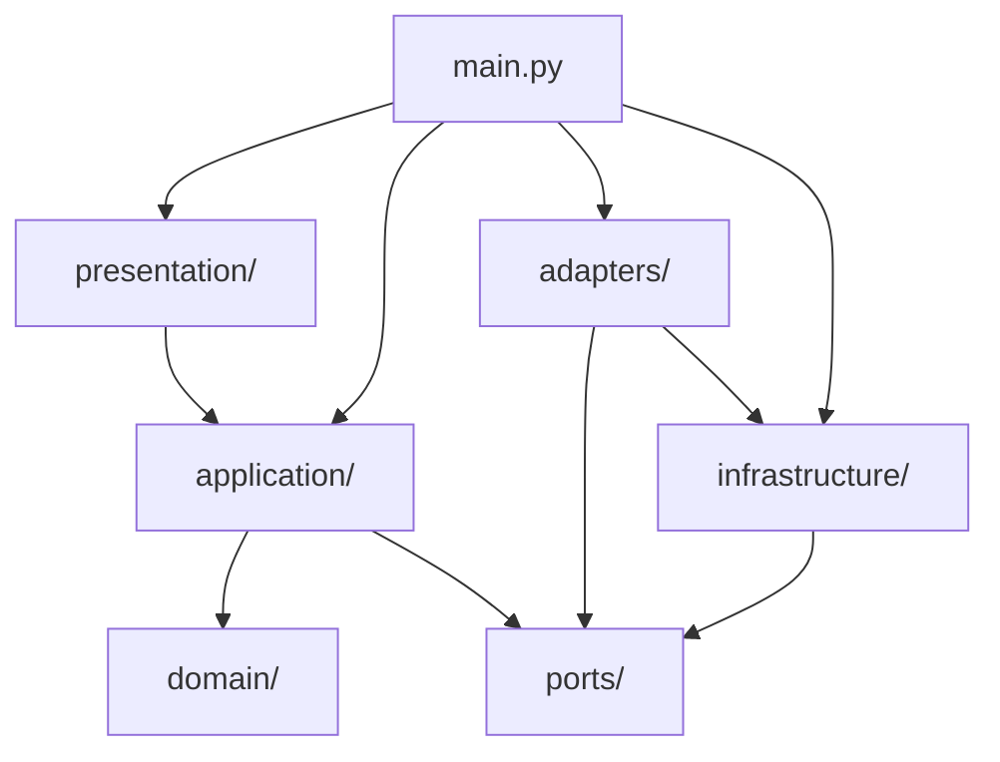

# HYDRA Refactor Report

Date: 2026-07-09
Scope: Structural refactor only

## Objective

Restructure HYDRA into a Domain-Driven Design plus Hexagonal Architecture without changing external behavior and without adding trading, market collector, websocket, or Binance-specific logic.

## What Changed

The codebase was reorganized into these packages:

- `src/hydra/domain`
- `src/hydra/application`
- `src/hydra/ports`
- `src/hydra/adapters`
- `src/hydra/infrastructure`
- `src/hydra/presentation`
- `src/hydra/shared`

The FastAPI behavior remains the same:

- `GET /`
- `GET /api/v1/health`
- `GET /api/v1/system/overview`

## Before and After

### Before

### After

## Mapping Summary

| Previous area | New location | Notes |
| --- | --- | --- |
| `core/architecture.py` | `domain/system.py` | Static architectural facts are now modeled as pure domain data. |
| `core/config.py` | `infrastructure/config.py` + `adapters/runtime_settings.py` + `ports/runtime_settings.py` | Settings are exposed through a port and adapter. |
| `core/logging.py` | `infrastructure/logging.py` | Logging remains infrastructure-owned. |
| `api/` | `presentation/api/` | HTTP layer now depends on application services only. |
| `db/base.py` | `infrastructure/database/base.py` | SQLAlchemy base is infrastructure. |
| `db/models.py` | `adapters/sqlalchemy_models.py` | ORM records are persistence adapters, not domain entities. |
| `db/session.py` | `infrastructure/database/session.py` | Session construction now depends on a runtime settings port instead of a module-global singleton. |
| `modules/` placeholders | `domain/system.py` | Placeholder pipeline concepts are represented as domain blueprint metadata rather than pseudo-services. |

## Behavior Preservation

The refactor intentionally preserved:

- API paths
- Response payload shape
- Live trading disabled status
- SDS-aligned system overview data
- Existing tests

## Non-Goals Preserved

This refactor does not introduce:

- trading logic
- market collector implementation
- websocket infrastructure
- Binance integration

## Technical Notes

1. The domain layer is now pure Python and does not import FastAPI, SQLAlchemy, Redis, or Pydantic.
2. Application services now orchestrate response building and depend on a `RuntimeSettingsPort`.
3. FastAPI route functions are factory-built in `presentation/` and consume application services only.
4. SQLAlchemy ORM records are intentionally separated from domain entities.
5. Runtime settings are no longer exposed as a module-global settings singleton to the rest of the codebase.

## Risks and Trade-offs

- The codebase has more structural indirection than before.
- Persistence and domain entities now coexist separately, which is correct architecturally but introduces mapping duplication risk.
- Future contributors must follow the layer boundaries consistently or the refactor will erode quickly.

## Verification

Validation completed after refactor:

- Existing HTTP smoke tests retained
- Test execution succeeded locally

## Recommended Next Steps

1. Add architecture tests that guard layer imports and forbidden framework usage in `domain/`.
2. Introduce repository ports only when real application use cases need persistence.
3. Keep all future framework-specific code out of `domain/` and `application/`.
